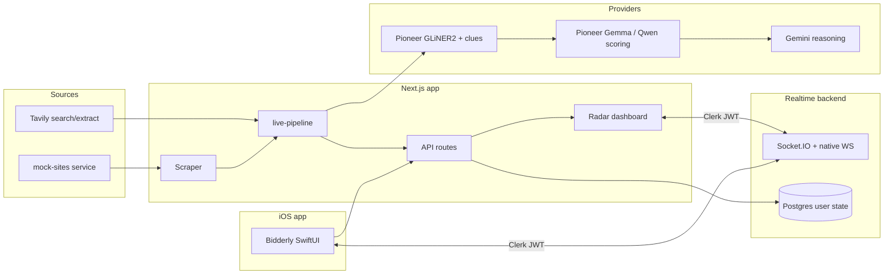

# Bidderly.win

Bidderly.win is a proactive tender and procurement opportunity radar for DACH sales teams. Scout agents watch German and EU procurement sources, run each finding through a cost-aware model cascade, and only interrupt humans when a decision actually moves the deal forward.

```text
scraper → fine-tuned Pioneer GLiNER2 → Pioneer/Gemma scoring → Gemini (gated)
```

The app ships with deterministic demo fixtures so the full product story works without provider keys. Production adapters plug into the same typed data model and API routes.

## Architecture



### How a scout run works

1. **Discovery** — The scraper hits four mock tender portals (TED EU, Bund.de, Munich, Berlin) hosted by the separate `mock-sites` service, follows internal detail links, and parses HTML into raw text. Tavily search/extract augments this when `TAVILY_API_KEY` is set and the mock host is publicly reachable (Tavily skips localhost).
2. **Extraction** — Fine-tuned Pioneer GLiNER2 models extract entities (buyer, project, deadline, budget, etc.) and procurement clue tags.
3. **Scoring / routing** — A Pioneer decoder model (Gemma 4 / Qwen SFT) returns `worthOutreachScore`, urgency, route (`ignore` | `monitor` | `qualify` | `human_review`), and rationale. Low-score findings are suppressed.
4. **Reasoning gate** — Gemini runs only when the cascade gate opens (high score, `human_review`, high urgency, or a blocker). See `src/lib/cascade.ts`.
5. **Human escalation** — Pending approvals sync across web and iOS via the realtime backend. Approved items can spawn AI-assisted **negotiations** (trade-off parameters, counterparty replies via Gemini).

With `DEMO_USE_FIXTURES=true` (default), scout runs return curated fixture data and never call external providers.

## Repository structure

| Path | Purpose |
| --- | --- |
| `src/app/` | Next.js App Router — landing page, `/radar`, `/negotiations`, `/settings`, auth pages |
| `src/app/api/` | REST handlers for radar, scout, Pioneer training, negotiations, cron |
| `src/components/` | UI — radar shell, landing sections, insights, negotiations |
| `src/lib/` | Core logic — cascade, demo fixtures, live pipeline, provider clients, Pioneer SDK, scraper, DB |
| `backend/` | Separate Fastify + Socket.IO service for per-user state (approvals, watchlist, dismissals) |
| `mock-sites/` | Standalone Fastify static server — four themed mock tender portals on port 3002 |
| `ios/Bidderly/` | Production SwiftUI companion app (ClerkKit auth, radar, approvals, negotiations, realtime) |
| `ios/BidderlyRadarDemo/` | Earlier minimal scaffold (superseded by `ios/Bidderly/`) |
| `public/mock-tenders/` | Legacy static HTML fixtures aligned with training data (used by demo fixtures, not the live scraper path) |
| `scripts/` | Pioneer training pipelines and Tavily/scraper verification |
| `docs/` | Postgres schema (`postgres-schema.sql`), legacy iOS notes |

## Features

### Web dashboard (`/radar`)

- **Radar** — Live feed of findings, extractions, scores, and opportunities
- **Approvals** — Pending human-review items with foreground toast alerts
- **Negotiations** — Start from an approved finding; Gemini generates counter-offer strategies and simulates buyer replies
- **Settings** — Integration status and configuration overview
- **Pipeline** — Scout run timeline and agent event log
- **Insights** — Geographic map, deadline timeline, value distribution
- **Pioneer** — Operational panel for synthetic data generation, training jobs, evaluations, and model routing

### Realtime sync

When `NEXT_PUBLIC_REALTIME_URL` is set, signed-in users connect to the `backend/` service over Socket.IO (web) or native WebSocket (iOS). User-specific approval decisions, watchlist entries, dismissals, and read state persist in Postgres and broadcast to all connected devices for that user.

### iOS companion (`ios/Bidderly/`)

Native SwiftUI app with ClerkKit authentication, radar summary, approval inbox, finding detail, negotiations, and foreground alerts via `AlarmManager`. Configure `API_BASE_URL` and `REALTIME_BASE_URL` in Xcode build settings / Info.plist (see `AppConfig.swift`).

### Mock tender portals (`mock-sites/`)

Four visually distinct portals — TED EU, Bund.de, stadt.muenchen.de, berlin.de — each with portal home pages and tender detail pages. Pages embed `<meta name="tender-id">` so the parser can recover stable finding IDs. Deployed separately on Railway in production; runs locally on port 3002 for development.

## Tech stack

| Layer | Technology |
| --- | --- |
| Web | Next.js 16 (App Router), React 19, Tailwind CSS 4, TypeScript |
| Auth | Clerk (`@clerk/nextjs` web, ClerkKit iOS) |
| Database | PostgreSQL via `pg` (radar snapshots + user state) |
| Realtime | Fastify 5, Socket.IO 4, native WebSocket |
| AI providers | Pioneer/Fastino (`api.pioneer.ai`), Google Gemini, Tavily |
| iOS | SwiftUI, ClerkKit, native WebSocket client |
| Deploy | Railway (Next.js, backend, mock-sites) |

## Local development

### Prerequisites

- Node.js 22.x
- PostgreSQL (optional — app falls back to in-memory fixtures without `DATABASE_URL`)
- Xcode 16+ (for iOS only)

### 1. Web app

```bash
npm install
cp .env.example .env.local
npm run dev
```

Open [http://localhost:3000](http://localhost:3000). The landing page is at `/`; the dashboard is at `/radar`.

### 2. Mock tender portals (recommended for live scout runs)

In a second terminal:

```bash
cd mock-sites
npm install
npm run dev
```

Serves portals at [http://localhost:3002](http://localhost:3002). Ensure `MOCK_TENDER_BASE_URL=http://localhost:3002` in `.env.local`.

### 3. Realtime backend (optional, for multi-device approval sync)

In a third terminal:

```bash
cd backend
npm install
cp ../.env.example .env   # or symlink; needs DATABASE_URL + Clerk keys
npm run dev
```

Listens on port 4001 by default. Set `NEXT_PUBLIC_REALTIME_URL=http://localhost:4001` in the web app's `.env.local`.

### 4. iOS app

1. Open `ios/Bidderly/Bidderly.xcodeproj` in Xcode.
2. Set build settings / Info.plist keys: `CLERK_PUBLISHABLE_KEY`, `API_BASE_URL` (e.g. `http://localhost:3000` or your machine IP), `REALTIME_BASE_URL` (e.g. `ws://localhost:4001`).
3. Build and run on simulator or device.

### 5. Verification scripts

```bash
# Tavily scout config + scraper smoke test
npx tsx scripts/verify-tavily-scout.ts

# Pioneer training pipelines (require PIONEER_API_KEY, PIONEER_DRY_RUN=false)
npx tsx scripts/pioneer-train-only.ts
npx tsx scripts/pioneer-big-train.ts
npx tsx scripts/pioneer-xl-train.ts
```

### Useful checks

```bash
npm run lint
npm run build
```

## Environment configuration

Copy `.env.example` to `.env.local` for the web app. The backend and mock-sites services read the same variables where noted.

### Core

| Variable | Description |
| --- | --- |
| `DATABASE_URL` | PostgreSQL connection string |
| `DB_AUTO_INIT` | When `true`, auto-creates `radar_snapshots` and user-state tables |
| `NEXT_PUBLIC_APP_URL` | Public web URL (e.g. `http://localhost:3000`) |
| `DEMO_USE_FIXTURES` | Default `true` — deterministic fixtures, no external API calls |

### Clerk auth

| Variable | Description |
| --- | --- |
| `NEXT_PUBLIC_CLERK_PUBLISHABLE_KEY` | Clerk publishable key |
| `CLERK_SECRET_KEY` | Clerk secret key |
| `NEXT_PUBLIC_CLERK_SIGN_IN_URL` | Default `/sign-in` |
| `NEXT_PUBLIC_CLERK_SIGN_UP_URL` | Default `/sign-up` |
| `CLERK_AUTHORIZED_PARTIES` | Allowed origins for backend JWT verification |
| `CLERK_WEBHOOK_SECRET` | Clerk webhook signing secret (backend) |

If Clerk keys are missing, the web proxy stays open so demo hosting works without auth.

### Realtime backend

| Variable | Description |
| --- | --- |
| `NEXT_PUBLIC_REALTIME_URL` | Web client Socket.IO URL (e.g. `http://localhost:4001`) |
| `REALTIME_BASE_URL` | iOS WebSocket URL (e.g. `ws://localhost:4001`) |
| `WEB_ORIGIN` | CORS origin for backend (e.g. `http://localhost:3000`) |
| `PORT` | Backend listen port (default `4001`) |

### Mock tender portals

| Variable | Description |
| --- | --- |
| `MOCK_TENDER_BASE_URL` | Mock-sites service URL (default `http://localhost:3002`) |
| `TAVILY_SCOUT_QUERY` | Optional override for Tavily search query |

### Pioneer / Fastino

| Variable | Description |
| --- | --- |
| `PIONEER_API_KEY` | Pioneer API key |
| `PIONEER_BASE_URL` | Default `https://api.pioneer.ai` |
| `PIONEER_DRY_RUN` | Default `true` — exercises code paths without live API calls |
| `PIONEER_GLINER2_MODEL` | Fine-tuned NER model id |
| `PIONEER_CLUES_MODEL` | Fine-tuned classification model id (defaults to NER model) |
| `PIONEER_GEMMA4_MODEL` | Fine-tuned scoring decoder model id |
| `PIONEER_*_DATASET` / `PIONEER_*_JOB_NAME` | Dataset and training job names |

The alignment contract in `src/lib/pioneer/schemas.ts` defines entity labels, clue labels, and the scoring prompt — shared by fixtures, synthetic builders, scraper output, and inference.

### Other providers

| Variable | Description |
| --- | --- |
| `TAVILY_API_KEY` | Tavily search and extract |
| `TAVILY_PROJECT_ID` | Optional Tavily project header |
| `GEMINI_API_KEY` | Gemini deep reasoning |
| `GEMINI_MODEL` | Default `gemini-2.5-pro` |
| `NEGOTIATION_MODEL` | Default `gemini-3.1-flash-lite` for negotiation replies |

### Scraper

| Variable | Description |
| --- | --- |
| `SCRAPER_ENABLED` | Default `true` |
| `SCRAPER_ALLOW_ALL` | Default `false`; set `true` in dev only to crawl any host |
| `SCRAPER_QPS` | Per-host rate limit (default `2`) |

### Demo / ops

| Variable | Description |
| --- | --- |
| `SCOUT_CRON_SECRET` | Bearer token for `GET\|POST /api/cron/scout` |

## API routes

| Route | Method | Description |
| --- | --- | --- |
| `/api/radar` | GET | Full radar snapshot |
| `/api/scout-run` | POST | Run full scout pipeline (Clerk-protected when configured) |
| `/api/scout-scrape` | POST | Scraper only — returns parsed pages |
| `/api/cron/scout` | GET, POST | Scheduled scout trigger (optional bearer auth) |
| `/api/events` | GET | Server-Sent Events stream of agent events |
| `/api/integrations` | GET | Provider configuration status |
| `/api/approvals/reset` | POST | Clear user approval state (Clerk-protected) |
| `/api/negotiations` | GET | List negotiations for current user |
| `/api/negotiations/start` | POST | Start negotiation from an approval |
| `/api/negotiations/[id]` | GET | Negotiation detail |
| `/api/negotiations/[id]/respond` | POST | Submit counter-offer or response |
| `/api/negotiations/reset` | POST | Reset negotiation store |
| `/api/pioneer/synthesize` | POST | Start synthetic data generation jobs |
| `/api/pioneer/synthesize/status` | GET, POST | Poll generation jobs |
| `/api/pioneer/train` | POST | Submit training jobs |
| `/api/pioneer/train/status` | GET, POST | Poll training jobs |
| `/api/pioneer/evaluations` | GET, POST | Run and read evaluations |
| `/api/pioneer/route` | GET | Active Pioneer model routing state |

Backend service (separate deploy):

| Route | Description |
| --- | --- |
| `GET /health` | Health check |
| `GET /state` | Load user state (Bearer JWT) |
| `POST /webhooks/clerk` | Clerk user lifecycle webhooks |
| Socket.IO `/socket.io` | Real-time state sync |
| Native WebSocket | iOS client path |

## Model cascade

### 1. Pioneer GLiNER2 extraction

Input: raw announcement text, source type, URL, detected language.

Output: structured entities (buyer, project, category, location, deadline, budget, contact) and clue tags (`budget_approved`, `supplier_call`, `official_tender`, `deadline_near`, etc.).

### 2. Pioneer scoring / routing

Output: `worthOutreachScore` (0–100), urgency (`low` | `medium` | `high`), route, rationale.

### 3. Gemini reasoning gate

Gemini is called only when `shouldCallGemini()` in `src/lib/cascade.ts` returns true:

- `worthOutreachScore >= 70`, or
- route is `human_review`, or
- urgency is `high`, or
- a blocker requires human judgment

## Agent roles

| Agent | Responsibility |
| --- | --- |
| Research scout | Discovers raw announcements via scraper and Tavily |
| Extraction agent | Runs fine-tuned GLiNER2; writes entities and clue tags |
| Scoring / routing agent | Runs decoder model; suppresses weak findings |
| Reasoning agent | Gemini for high-value or blocker cases only |
| Human escalation | Creates approval requests for `human_review` and blockers |

## Postgres

When `DATABASE_URL` is set:

- **`radar_snapshots`** — Latest full radar snapshot as JSONB (auto-created with `DB_AUTO_INIT=true`)
- **User state tables** — `user_approvals`, `user_dismissals` (web app); backend adds `user_watchlist`, `user_read_state`, `users`

The long-term relational schema (sources, findings, extractions, scores, opportunities) is defined in `docs/postgres-schema.sql` for future migration.

## Deployment (Railway)

Three services are typically deployed:

1. **Next.js app** — `railway.json` at repo root; health check `/api/radar`
2. **Realtime backend** — `backend/` with `PORT`, `DATABASE_URL`, Clerk vars
3. **Mock tender portals** — `mock-sites/` with its own `railway.json` and Dockerfile

Set `MOCK_TENDER_BASE_URL` to the public mock-sites URL. Set `DEMO_USE_FIXTURES=false` only when Tavily, Pioneer, and Gemini keys are configured.

For `bidderly.win` DNS, point Cloudflare CNAME records at the Railway public domain and set `NEXT_PUBLIC_APP_URL=https://bidderly.win`.

## Demo script

1. Open `http://localhost:3000/radar`.
2. Confirm watched German/EU sources appear in the sidebar.
3. Click **Run scout**.
4. Open a high-value finding (e.g. Munich or EU).
5. Show GLiNER2 extracted entities and clue tags.
6. Show scoring model route, score, urgency, and rationale.
7. Show low-score duplicates routed to `ignore` without alerts.
8. Show Gemini analysis only on gated findings.
9. Approve or request info on a pending approval.
10. Optionally start a **negotiation** from an approved item.

## Known scope boundaries

- Fixtures are the default; live scraping is limited to the mock-sites allow list plus Tavily enrichment.
- Locked-screen push notifications are out of scope; foreground alerts are the demo target.
- Negotiation state is in-memory on the Next.js server (resets on deploy).
- `ios/BidderlyRadarDemo/` is a legacy scaffold; use `ios/Bidderly/` for the current app.
- `docs/ios-companion.md` describes the older demo scaffold and may be stale.

## Key source files

| File | Role |
| --- | --- |
| `src/lib/live-pipeline.ts` | Scout orchestration (scraper → Tavily → cascade) |
| `src/lib/provider-clients.ts` | Tavily, Pioneer, and Gemini adapters |
| `src/lib/demo-data.ts` | Fixtures and synthetic training examples |
| `src/lib/cascade.ts` | Gemini gate and routing helpers |
| `src/lib/negotiation.ts` | Negotiation engine |
| `src/lib/pioneer/` | Pioneer API client, training, inference, schemas |
| `src/lib/scraper/` | Host-allow-listed HTML fetcher and parser |
| `src/proxy.ts` | Clerk middleware (protects scout-run and approvals reset) |
| `backend/src/server.ts` | Realtime Socket.IO + WebSocket server |
